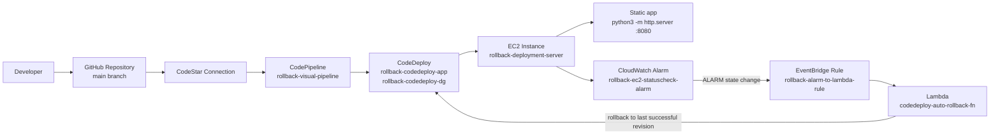

# Cloud Deployment Rollback System
An automated AWS deployment pipeline that protects releases with hands-free rollback. It solves the operational problem of shipping a bad deployment to EC2 and then waiting on manual intervention to restore service.

## Description

This project automates delivery to an EC2 host through CodePipeline and CodeDeploy, then watches the instance health signal for failure. When a deployment leaves the server unhealthy, the rollback path replays the last known good revision so service recovery happens with minimal downtime.

## Tech Stack

- Languages: PowerShell, Python, Bash
- AWS services: CodePipeline, CodeDeploy, EC2, CloudWatch, EventBridge, Lambda, S3, IAM, CodeStar Connections
- Deployment config: AppSpec, BuildSpec, JSON IAM policies
- Runtime: Python 3.12 Lambda, Python built-in `http.server` on port 8080

## Why This Project Exists

Problem: a deployment can succeed in the pipeline but still leave the target instance unhealthy, which makes manual rollback slow and error-prone.

Solution: the pipeline deploys with CodeDeploy, CloudWatch watches the EC2 `StatusCheckFailed` metric, and EventBridge triggers Lambda to redeploy the last successful revision when the alarm fires.

## Architecture



## Key Features

- Automated feature flow for infrastructure, deployment, and rollback in one repo.
- AppSpec-driven lifecycle hooks for stop, install, and start on EC2.
- Lambda rollback logic that selects the latest failed deployment and the last successful deployment.
- Repeatable setup scripts for the pipeline, IAM roles, alarm, and EventBridge target.
- Minimal sample app to prove the end-to-end deployment and recovery path.

## Validation Snapshot

| Metric | Value |
| --- | --- |
| Pipeline stages | 2 |
| Deployment target | 1 EC2 instance tagged `rollback-deployment-server` |
| Rollback trigger | CloudWatch `StatusCheckFailed` alarm |
| Rollback orchestrator | 1 Lambda function |
| Recovery path | EventBridge -> Lambda -> CodeDeploy |

## How to Run

Prerequisites: AWS CLI, PowerShell 7+, a running EC2 instance with the CodeDeploy agent, and a GitHub repo connected through CodeStar Connections.

```powershell
cd cloud-deployment-rollback-system
pip install -r requirements.txt
pwsh ..\automation\create-codepipeline.ps1
```

After the pipeline exists, run `pwsh ..\automation\setup-auto-rollback.ps1` to create the Lambda rollback path, alarm, and EventBridge rule.

## Demo

Add a short GIF or screenshot here showing the CodePipeline execution and the app responding on port 8080. A visual trace makes the rollback story easier to explain in a portfolio or interview.

## Repository Structure

```text
cloud-deployment-rollback-system/
├── appspec.yml
├── buildspec.yml
├── requirements.txt
├── app/
│   └── index.html
├── scripts/
│   ├── install.sh
│   ├── start.sh
│   ├── start_server.sh
│   ├── stop.sh
│   └── stop_server.sh
└── README.md

automation/
├── create-codepipeline.ps1
├── setup-auto-rollback.ps1
├── rollback_lambda.py
└── policy, trust, and pipeline JSON files
```

## Notes

- The sample application is intentionally minimal so the deployment and rollback mechanics stay easy to inspect.
- The Lambda function does not create a new app version; it promotes the most recent successful revision.
- If you have real runtime numbers from your own deployment, replace the Validation Snapshot with those results.

## Troubleshooting CodeDeploy

Use `aws deploy` commands (not `aws codedeploy`) with AWS CLI v2:

```powershell
aws deploy get-deployment-group --application-name rollback-codedeploy-app --deployment-group-name rollback-codedeploy-dg --region ap-southeast-2
aws deploy list-deployments --application-name rollback-codedeploy-app --deployment-group-name rollback-codedeploy-dg --region ap-southeast-2 --include-only-statuses Failed InProgress Succeeded
aws deploy get-deployment --deployment-id <deployment-id> --region ap-southeast-2
```

On the EC2 instance, inspect CodeDeploy agent and lifecycle logs:

```bash
sudo systemctl status codedeploy-agent
sudo tail -n 200 /var/log/aws/codedeploy-agent/codedeploy-agent.log
sudo tail -n 200 /opt/codedeploy-agent/deployment-root/deployment-logs/codedeploy-agent-deployments.log
```

Common failure causes in this project:

- CodeDeploy application/deployment group is missing or points to the wrong EC2 tag.
- EC2 instance does not have the CodeDeploy agent running.
- Lifecycle hook scripts fail due to missing runtime packages or Linux line-ending issues.
- AWS credentials do not have access to AWS Deploy APIs (`SubscriptionRequiredException` or IAM deny).
